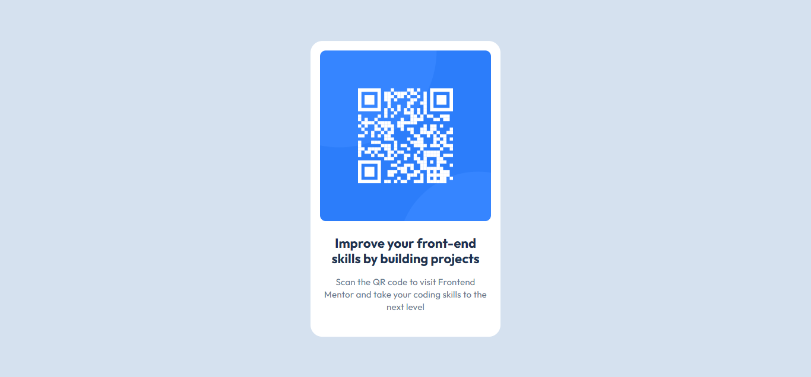

# Frontend Mentor - QR code component solution

This is a solution to the [QR code component challenge on Frontend Mentor](https://www.frontendmentor.io/challenges/qr-code-component-iux_sIO_H). Frontend Mentor challenges help you improve your coding skills by building realistic projects.

## Table of contents

- [Overview](#overview)
  - [The challenge](#the-challenge)
  - [Screenshot](#screenshot)
  - [Links](#links)
- [My process](#my-process)
  - [Built with](#built-with)
  - [Useful resources](#useful-resources)
- [Author](#author)
- [Acknowledgments](#acknowledgments)

## Overview

### The challenge

Users should be able to:

- View the optimal layout depending on their device's screen size

### Screenshot

### Links

- Solution URL: [Click here](https://github.com/trevorcj/frontend-mentor-qr-code-component)
- Live Site URL: [Visit live site](https://trevorcj-qrcode-component.netlify.app/)

## My process

### Built with

- Semantic HTML5 markup
- CSS custom properties
- Flexbox

### Useful resources

- [Frontend Mentor Community](https://www.frontendmentor.io/community) - The community provided valuable insights and feedback.

## Author

- Frontend Mentor - [@trevorcj](https://www.frontendmentor.io/profile/trevorcj)

## Acknowledgments

Thanks to the Frontend Mentor community for their support and feedback throughout this challenge. It was a great learning experience!
